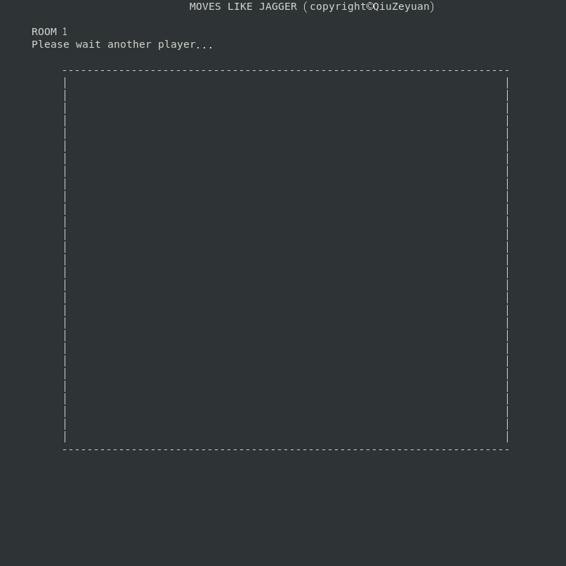
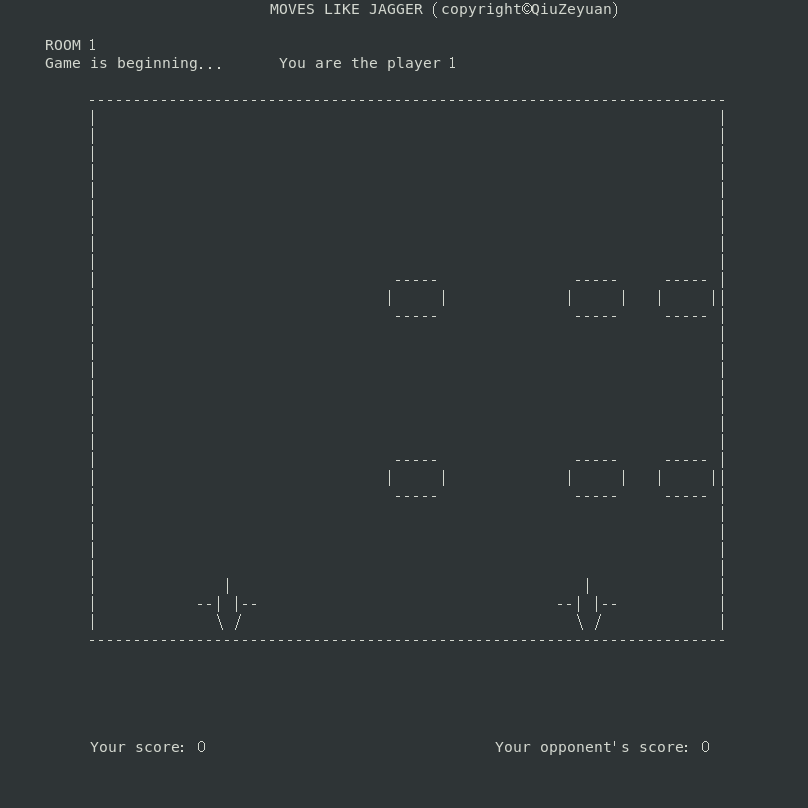
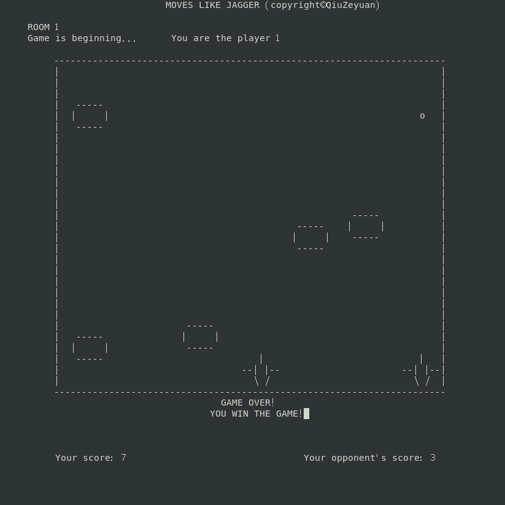
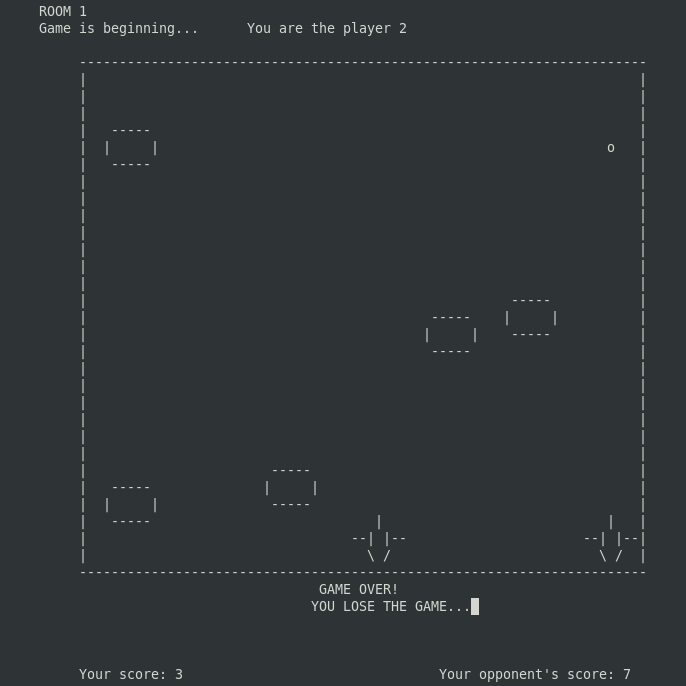
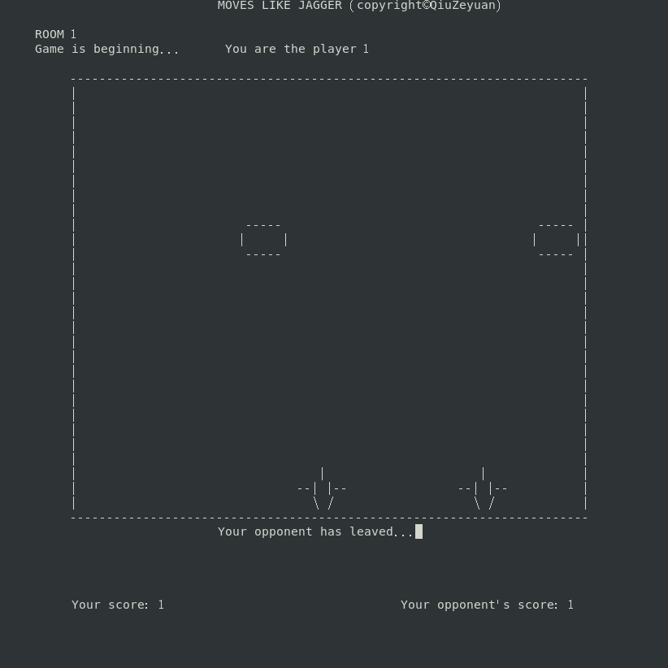

# 项目介绍
MOVE LIKE JAGGER是一个基于Linux操作系统的双人射击游戏，可支持多个房间同时进行游戏。该游戏使用了网络编程、服务器编程相关技术。

# 项目进度
- [X] 确定游戏规则，做到游戏的竞争与合作的平衡
- [X] 确定游戏区域范围精确坐标
- [X] 创建监听连接，可接收两个客户端的连接请求
- [X] 在两个客户端均建立连接的基础上，显示游戏区域
- [X] 修改连接接收模块的设计，将单个房间扩展为多个房间同时进行，并显示房间号
- [X] 在游戏区域绘制发射装置，双方玩家可控制自己的发射装置，并设置移动边界
- [X] 规划飞行物轨道尺寸，生成可移动的飞行物，飞行物向下匀速飞行
- [X] 设置飞行物数量随机产生规则以控制其数量，飞行物到达下边界消失
- [X] 添加子弹，子弹可向上匀速飞行，到达上边界消失
- [X] 进行子弹和飞行物碰撞判断
- [X] 增加积分模块，实时展示双方分数
- [X] 增加分数判断及游戏结果显示模块
- [X] 压测服务端
- [X] 优化测试，完善细节

# 下载编译
## 下载仓库
```
git clone https://github.com/zeyuanqiu/moves-like-jagger.git
```
## 服务端编译
```
cc -o server -lpthread server.c
```
## 客户端编译
```
cc -o client -lpthread -lcurses client.c
```

# 运行
## 服务端
* 服务端开启50000端口
```
./server 50000
```
## 客户端
### 本机多窗口游戏
* 玩家1
```
./client 127.0.0.1 50000
```
* 玩家2
```
./client 127.0.0.1 50000
```
### 联网游戏
* 若服务端在云服务器上运行，且该云服务器配有公网IP（如9.134.113.239），则可以通过公网IP实现联网游戏
* 玩家1
```
./client 9.134.113.239 50000
```
* 玩家2
```
./client 9.134.113.239 50000
```

# 游戏规则
1. 1号玩家进入游戏后，需要等待2号玩家进入同一游戏房间才能开始当前游戏。3号玩家进入游戏后，会进入新的游戏房间，等待4号玩家。以此类推。
2. 双方玩家可按下**a**和**d**（英文小写模式）键控制自己的发射装置，a键为左移，d键为右移，移动到左右边界不可再移动。
3. 游戏过程中，游戏区域内会随机产生飞行物匀速向下移动。
4. 双方玩家可按下**空格**键发射子弹，子弹匀速向上运动，子弹击中飞行物或到达上边界则消失。
5. 若飞行物被子弹击中，则飞行物和子弹均消失，发射子弹的玩家积分+1（**游戏竞争约束**）。
6. 若飞行物到达下边界，则游戏结束（**游戏合作约束**）。
7. 游戏结束时，双方客户端将显示各自的游戏结果，游戏结果以双方在游戏结束时的积分进行判定，有胜利、失败、打平三种游戏结果。
8. 任意一方在游戏途中可按**q**键直接退出游戏。同一游戏房间内另外一名玩家的客户端将显示对手退出游戏的消息，游戏界面停止，按**q**可退出客户端。

# 游戏展示
1. 玩家等待
* 玩家1界面展示
<div align=center>

</div>

2. 游戏进行
* 玩家1界面展示


3. 结果判定
* 玩家1界面展示


* 玩家2界面展示


4. 玩家退出
* 玩家2游戏中途退出，玩家1界面展示
